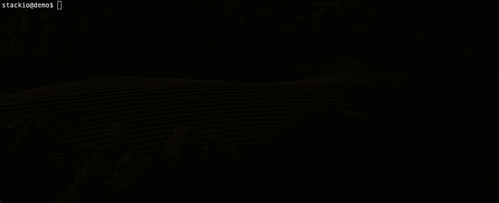

# Quick AWS Compliance Checks

## Introduction
This project aims to enhance cloud security by performing compliance checks in AWS environments, addressing key risks identified in [Datadog's State of Cloud Security report](https://www.datadoghq.com/state-of-cloud-security/).

## Features
- **Long-lived Credentials Check**: Identifies and reports on static, non-expiring credentials, a major cause of cloud security breaches【[”](https://www.datadoghq.com/state-of-cloud-security/#1)】.
- **Public Access Block Checks**: Monitors public access settings in cloud storage services to prevent data leakage【[”](https://www.datadoghq.com/state-of-cloud-security/#4)】.
- **MFA Enforcement Verification**: Ensures Multi-Factor Authentication is enforced for cloud access, crucial for preventing account takeovers【[”](https://www.datadoghq.com/state-of-cloud-security/#2)】.
- **VMs Internet Exposure Audit**: Assesses the exposure of virtual machines to the public internet to mitigate the risk of attacks【[”](https://www.datadoghq.com/state-of-cloud-security/#6)】.
- **IMDSv2 Enforcement**: Validates the enforcement of Instance Metadata Service V2 (IMDSv2) to protect against server-side request forgery (SSRF) attacks【[”](https://www.datadoghq.com/state-of-cloud-security/#3)】.
- **Excessively privileged workload**: Checks if full permission is granted to any entity and if Access Analyzer is enabled to mitigate possible workloads given excessive privileges[”](https://www.datadoghq.com/state-of-cloud-security/#5)】.

## Requiments
The following is required to run this project properly:
- [Steampipe](https://steampipe.io/downloads)
- [AWS CLI](https://docs.aws.amazon.com/cli/latest/userguide/getting-started-install.html)

## Usage
- Clone the repo
- Set the AWS credentials properly
- Execute the `report.sh` file

Demo:

## License
This project is distributed under GNU GPLv3. See [LICENSE](LICENSE).
